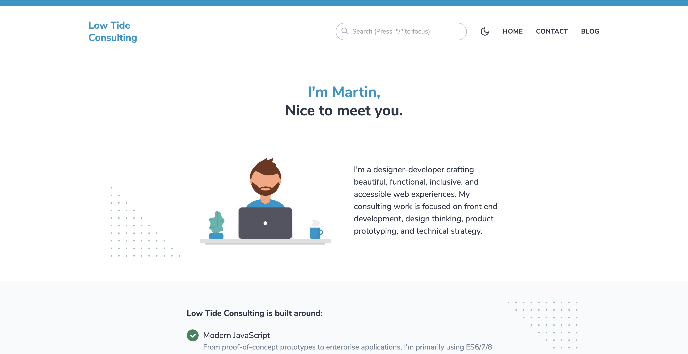

# Low Tide Consulting

Built with the help of great open-source software like:
[https://gridsome-portfolio-starter.netlify.com](https://gridsome-portfolio-starter.netlify.com)

## Features

- Clean and minimal design
- [Tailwind CSS v1.0](https://tailwindcss.com) (with PurgeCSS)
- Scroll to sections using [vue-scrollto](https://github.com/rigor789/vue-scrollto)
- Blog with markdown content for posts
- Theme Switcher with Dark Mode
- Search posts with [Fuse.js](https://fusejs.io) and [vue-fuse](https://github.com/shayneo/vue-fuse)
- Tags for posts
- Basic pagination
- Syntax highlighting with [Shiki](https://shiki.matsu.io) (using [this gridsome plugin](https://gridsome.org/plugins/gridsome-plugin-remark-shiki))
- 404 Page
- RSS Feed
- Sitemap in XML

## Installation

1. Install Gridsome CLI tool if you don't have it: `npm install --global @gridsome/cli`
1. Clone the repo: `git clone https://github.com/drehimself/gridsome-portfolio-starter.git`
1. `cd gridsome-portfolio-starter`
1. `npm install`
1. `gridsome develop` to start a local dev server at `http://localhost:8080`

## Notes

 - Illustrations from [unDraw](https://undraw.co)
 - Search is based on [Fuse.js](https://fusejs.io) and [vue-fuse](https://github.com/shayneo/vue-fuse). It only searches the title and summary of posts for now. Some tweaking may be necessary to get it to search to your liking. Check out the fuse documentation for search settings. A `search.json` index file is generated at build time. This happens in `gridsome.server.js`.

## Creative Commons License
 Low Tide Consulting Corporate Site by <a xmlns:cc="http://creativecommons.org/ns#" href="consultlowtide.ca" property="cc:attributionName" rel="cc:attributionURL">Martin Laws</a> is licensed under a <a rel="license" href="http://creativecommons.org/licenses/by/4.0/">Creative Commons Attribution 4.0 International License</a>. Based on a work at <a xmlns:dct="http://purl.org/dc/terms/" href="https://github.com/consultlowtide/consultlowtide.ca" rel="dct:source">https://github.com/consultlowtide/consultlowtide.ca</a>.
