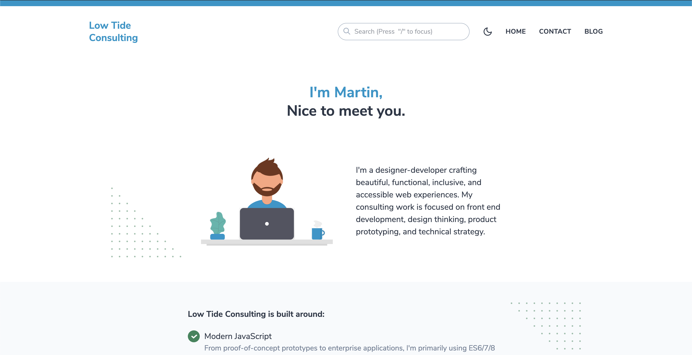

### What is JAMstack?
JavaScript, API & Markup. Per CEO & Co-founder of [Netlify](https://www.netlify.com) Mathias Biilmann:

> "[JAMstack is] a modern web development architecture based on client-side JavaScript, reusable APIs, and prebuilt Markup."

#### JavaScript

Dynamic functionality is handled by JavaScript. There are no restrictions to which framework or libraries are available. In the case of this site, I've opted for [Gridsome](https://gridsome.org/).

- It's lightning fast and highly performant.
- Has a great developer experience built around [Vue](https://vuejs.org/) and [GraphQL](https://graphql.org/). 
- Allows for easy (and free!) deployments and hosting through [GitHub Pages](https://pages.github.com/).

#### APIs

Server side operations are abstracted into reusable APIs and accessed over HTTPS with JavaScript. These can be third party services (like the [FormSpree](https://formspree.io/) form on the contact section of this site!) or custom functions you deploy to [Netlify Functions](https://functions.netlify.com/examples/), [AWS Lambda](https://aws.amazon.com/lambda/features/), or [Microsoft Azure Functions](https://azure.microsoft.com/en-ca/services/functions/). These services afford us API endpoints which invoke a JavaScript functions when called. This "serverless" architecture allows us to scale quickly without maintaining a back-end codebase!

#### Markup

Every page on this site is served as a static HTML file. These are generated from source files, in this case Markdown. [Gridsome](https://gridsome.org/) eats up my Markdown via [GraphQL](https://graphql.org/) (this could easily be calling a content API like [SiteLeaf](https://www.siteleaf.com/)) and pipes the data into our own templates. These statically generated pages can be combined with the power of [Vue](https://vuejs.org/) to bring the best parts of _Single Page Applications_ and _Server Side Rendering_ together at last.

<!-- ### What does the development experience look like?

- **Local development with hot-reloading** - The tooling and development experience we expect from [Vue](https://vuejs.org/).
- **File-based page routing** - Quickly create and manage routes with files.
- **Data source plugins** - Use it for any popular Headless CMSs, APIs or Markdown-files.
- **Centralized data managment** - Pull data into a local, unified GraphQL data layer.
- **Auto-optimized code** - Get code-splitting and asset optimization out-of-the-box. -->

### What's the workflow?

- **Local development** - From writing this blog post in markdown to developing the Vue components, layouts and pages, local development is friendly and approachable.
- **Version Control and Continous Deployments from GitHub** - Pushes to [this site's public GitHub repo](https://github.com/consultlowtide/consultlowtide.github.io) trigger automated builds, generation of static assets, and deployments to GitHub Pages' CDN.
- **Highly Available, Cached CDN Hosting** - GitHub Pages, Netlify, surge.sh, and others allow our sites to load lightning fast no matter the amount of (or spikes in) request traffic.

### Like what you see?

Please, [reach out](/#contact)!